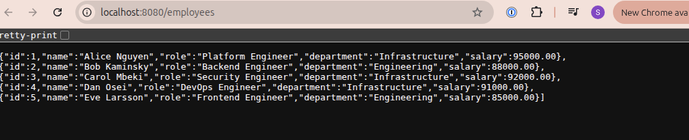

# Infrastructure Take Home

Treat this system as a production system.

## Getting Started

Clone this repository locally.
Create your own public git repository in github or somewhere we can access and push this code into it.
Make changes to your repository.
Getting things to work for you is part of the assessment.

You will be assessed by someone cloning your repository when you're finished and running your instructions to recreate the expected solution.
If we cannot run your repository instructions we cannot assess your work.

### Prerequsites

You will need the following:
* docker runtime and tools
* k3d CLI
* opentofu binary or terraform
* kubectl binary
* git

## Starting point

Use terraform or opentofu to initialise a k3d cluster and postgres instance locally from the `tofu` directory.
Install Argo CD into the k3d cluster by following the instructions in the `argocd` directory.

# Problem

Please add commits to your fork of the repo to answer this problem.
Note: the use of the word `postgrest` is confusing, but correct - this is a project that we're going to deploy.

## Add a user to the database

Please add a super user to the postgrest database.

## Inject a secret for postgrest

Creating a superuser account in this new database, inject the secrets into the k3d cluster into a namespace called postgrest.
You must do this with terraform/opentofu.

## Install Postgrest into the k3d cluster

https://docs.postgrest.org/en/v14/

The result should be an accessible endpoint that you can use in your browser.

## Inject some data from the cluster using a `Job`

Use a kubernetes job to inject some data into the postgres database

## Provide an expected screenshot

Update this file, README.md, with a screenshot of what we should see when we visit the URL after following your instructions - this should show us the data you have injected.

---

# Solution

## Architecture

```
┌─────────────────────────────────────────────────────┐
│  Docker network: infra-takehome-network              │
│                                                      │
│  ┌──────────────────────┐   ┌─────────────────────┐ │
│  │ postgres-infra-       │   │  k3d cluster node   │ │
│  │ takehome:5432         │   │                     │ │
│  │ (postgres:16-alpine)  │   │  ┌───────────────┐  │ │
│  └──────────────────────┘   │  │ postgrest pod  │  │ │
│                              │  │ (PostgREST     │  │ │
│                              │  │  v12.2.3)      │  │ │
│                              │  └───────────────┘  │ │
│                              └─────────────────────┘ │
└─────────────────────────────────────────────────────┘
         ▲
         │ localhost:5432
         │ localhost:8080 → traefik ingress → postgrest svc
```

Both the Postgres container and the k3d cluster nodes are placed on the same Docker network (`infra-takehome-network`). A Kubernetes `Service` + `Endpoints` object in the `postgrest` namespace maps the DNS name `postgres:5432` to the container's Docker-network IP, so PostgREST pods can reach the database.

Terraform/OpenTofu manages:
- The Docker network, Postgres container, and k3d cluster
- The PostgreSQL superuser role (`postgrest_user`)
- The Kubernetes `postgrest` namespace and `postgrest-config` secret

Kubernetes manifests (`k8s/postgrest/`) manage:
- PostgREST Deployment + Service + Ingress (browser-accessible at `http://localhost:8080`)
- A seed Job that creates the `employees` table and inserts sample data

## Setup Instructions

### 1. Create the infrastructure

```bash
cd tofu
tofu init
tofu apply -target=terraform_data.k3d_cluster   # create cluster first so kubeconfig exists
tofu apply                                        # create postgres user, secret, and k8s service
```

> **Note:** The two-step apply is required on first run. The `hashicorp/kubernetes` provider
> needs the k3d cluster (and its kubeconfig context) to exist before it can create resources.

### 2. Install ArgoCD

```bash
kubectl create namespace argocd
kubectl apply --server-side -k argocd/argocd/
```

### 3. Deploy PostgREST and seed data

```bash
kubectl apply -k k8s/postgrest/
```

Wait for the deployment and seed job to complete:

```bash
kubectl rollout status deployment/postgrest -n postgrest
kubectl wait --for=condition=complete job/seed-data -n postgrest --timeout=120s
```

### 4. Access the API

Open your browser at: **http://localhost:8080/employees**

### Teardown

```bash
kubectl delete -k k8s/postgrest/
cd tofu && tofu destroy
```

## Expected Result

After following the setup instructions, visiting `http://localhost:8080/employees` returns a JSON array of the seeded employees:

```json
[
  {"id":1,"name":"Alice Nguyen","role":"Platform Engineer","department":"Infrastructure","salary":"95000.00"},
  {"id":2,"name":"Bob Kaminsky","role":"Backend Engineer","department":"Engineering","salary":"88000.00"},
  {"id":3,"name":"Carol Mbeki","role":"Security Engineer","department":"Infrastructure","salary":"92000.00"},
  {"id":4,"name":"Dan Osei","role":"DevOps Engineer","department":"Infrastructure","salary":"91000.00"},
  {"id":5,"name":"Eve Larsson","role":"Frontend Engineer","department":"Engineering","salary":"85000.00"}
]
```


